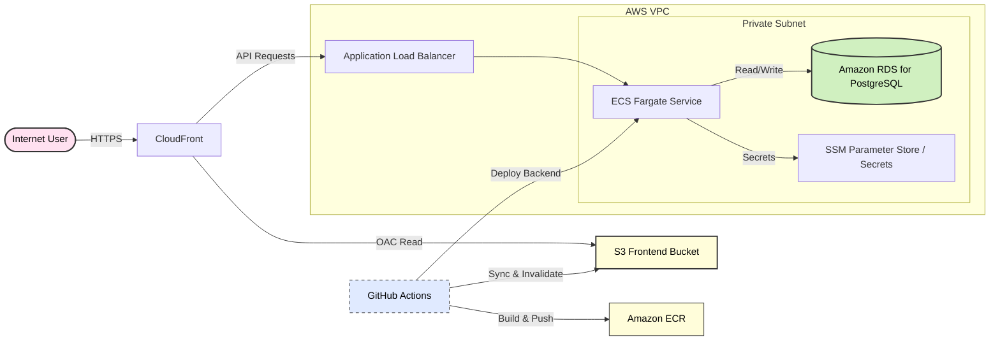

# Scalable Stateful Microservice on AWS (ECS + RDS)
_A reference implementation of cloud-native architecture, Infrastructure as Code (IaC), and automated CI/CD._

[](https://aws.amazon.com/)
[](https://www.terraform.io/)
[](https://www.docker.com/)
[](https://github.com/Ogstra/cloud-native-notes/actions/workflows/deploy.yml)
[](LICENSE)

## Project Overview
This project demonstrates how to operate a stateful workload in AWS using production-style DevOps practices, not just how to build an app feature.

The engineering problem solved here is the transition from ad-hoc deployments to a reproducible, cloud-native delivery model where infrastructure, application releases, database migrations, and runtime health are managed as one system.

It showcases:
- Immutable infrastructure provisioning with Terraform.
- Containerized services deployed on ECS Fargate.
- Managed relational data persistence with Amazon RDS.
- Automated CI/CD pipelines for build, migration, and rollout.
- Operational guardrails such as health checks, structured logging, and controlled rollbacks.

## Architecture Diagram


## Technology Stack
| Layer | Technologies |
|---|---|
| Infrastructure | AWS (VPC, ECS, RDS, ALB, IAM), Terraform |
| Containerization | Docker (multi-stage builds), Amazon ECR |
| CI/CD | GitHub Actions (automated build, migration, deployment) |
| Security | Trivy (vulnerability scanning, integration-ready), IAM Roles, Secrets Manager/SSM Parameter Store |
| Observability | CloudWatch, structured JSON logging (`request_id` correlation), Prometheus-ready pattern |
| Backend | Node.js (TypeScript, NestJS, Prisma) |

## Key Features
- **Infrastructure as Code:** Immutable infrastructure provisioned entirely through Terraform modules.
- **Zero-Downtime Deployment:** Rolling service updates in ECS with health-based traffic routing through ALB.
- **Security First:** Rootless containers, encrypted secret injection, and Trivy-ready image scanning hooks.
- **Self-Healing:** Health checks and service orchestration behavior for automatic unhealthy task replacement.

## Quick Start
### Prerequisites
- Docker + Docker Compose
- GNU Make

### Commands
```bash
make build
make deploy-local
```

### Local Endpoints
- Frontend: `http://localhost:8080`
- API: `http://localhost:3000/api`
- Healthcheck: `http://localhost:3000/healthz`

## Repository Structure
```text
.
├── app/
│   ├── backend/        # NestJS API + Prisma
│   └── frontend/       # Vite frontend
├── iac/terraform/      # AWS infrastructure as code
├── .github/workflows/  # CI/CD pipelines
├── docker-compose.yml  # Local orchestration
└── Makefile            # Local developer commands
```

## CI/CD Workflows
- `infra.yml`: Terraform validate/plan/apply for infrastructure changes.
- `deploy.yml`: Build and push images, run migration task, update ECS services.
- `run-migration.yml`: Manual migration execution for controlled DB operations.

## Operational Notes
- Configuration is 12-factor style via environment variables.
- Missing critical env vars fail startup by design.
- Logs are JSON-formatted for ingestion in CloudWatch/Grafana pipelines.
- Rollback is performed by switching ECS services to previous task definition revisions.
